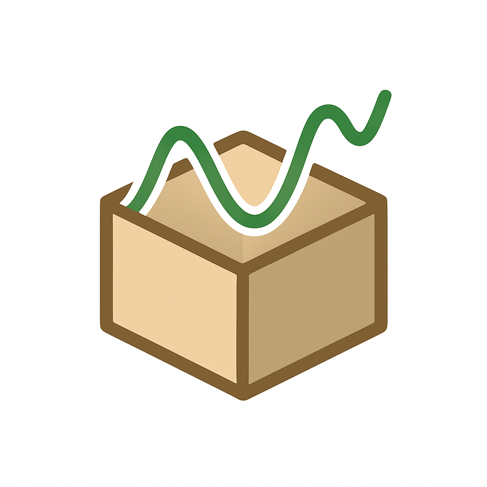

# CGMSandbox

<p align="center">
  
</p>

CGMSandbox is an open-source, modular tool enabled by JupyterHealth Exchange. It is designed to make continuous glucose monitoring (CGM) data interactive, reproducible, and extensible.
It empowers developers, researchers, and engaged CGM users to explore how glucose dynamics respond to real-world behaviors such as meals and sleep, monitored by other digital technologies.

## Environment Setup

We recommend using **Python >3.11**

### 1. Clone the Repository

This repository should already be cloned into your JupyterHub environment for the JupyterCon Tutorial. If for some reason you can't locate it in your directory, you may use the commands below to clone the repository manually.

```bash
git clone https://github.com/billchen0/cgm-sandbox.git
cd cgm_sandbox
```

### 2. Create and Activate a Virtual Environment
```bash
python -m venv .venv
(macOS/Linux) source .venv/bin/activate
(Windows) .venv\Scripts\activate
```

### 3. Install Dependencies
```bash
pip install -r requirements.txt
```

## Directory Structure

```
Below is an overview of the CGMSandbox codebase structure. Files that you will actively work with in this tutorial are marked with 🧩. You may view the other folders and files if you are interested, but it is not required for the purpose of this tutorial!

cgm-sandbox/
├── fonts/                      # Custom fonts for the CGMSandbox Environment
├── sample_subject/             # Local data files if JupyterHealth Client aren't accessible for some reason
├── solutions/                  # Solutions for hands-on exercises and code-alongs
│
├── cgm_methods.py              # Preprocessing and CGM data manipulation
├── cgmquantify.py              # For computing CGM-based biomarkers (GMI, CV, MAGE, etc.)
├── extensions.py               # Extend the viewer with additional figures
├── loader.py                   # Data loading utilities for CGM, food entry, and sleep
├── overlays.py            🧩   # Where you’ll create your own visualization overlays
├── viewer.py                   # Core plotting engine (handles axes, scaling, time windows)
│
├── cgmsandbox.ipynb       🧩   # Example notebook for running the Sandbox
├── requirements.txt            # Environment dependencies
└── README.md                   # You are here 🙂
```